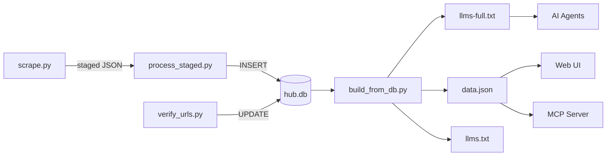

# Renaissance AI and Education Resource Hub

[](https://jchoi92k.github.io/Learning-Engineering-Resource-Hub)
[](https://github.com/jchoi92k/Learning-Engineering-Resource-Hub/commits/main)
[](#status)
[](https://www.python.org/)
[](https://claude.ai/code)

A curated, agent-first referratory of evidence-based K-12, higher-education, and learning-engineering research resources — optimized for LLM consumption.

> New to the repo? Start with [`index.md`](index.md) for a full file map and common operations.

---

## Quick start

**Browse the collection** — no setup required:
[jchoi92k.github.io/Learning-Engineering-Resource-Hub](https://jchoi92k.github.io/Learning-Engineering-Resource-Hub)

**AI agents** — fetch the full index or connect via MCP:
```
https://jchoi92k.github.io/Learning-Engineering-Resource-Hub/llms-full.txt
MCP endpoint: https://renaissance-hub.joon-96a.workers.dev
```

**Run locally / contribute:**
```bash
git clone https://github.com/jchoi92k/Learning-Engineering-Resource-Hub.git
cd Learning-Engineering-Resource-Hub/docs
python -m http.server 8765    # browse at localhost:8765
```

---

## What's in it

**Research & evidence** — What Works Clearinghouse, Evidence for ESSA, Mathematica, Campbell Collaboration, IES Regional Education Labs, Brookings, AIMS Collaboratory, NWEA, WestEd, UChicago Consortium, CREDO at Stanford

**Policy & practice** — Learning Policy Institute, Education Trust, CASEL, National Academies Press, TNTP, Digital Promise

**Journals** — Journal of Educational Data Mining (JEDM), Journal of Learning Analytics (JLA)

**Tools & platforms** — Tools Competition winners, LEVI Math teams (Carnegie Learning, Khan Academy, CMU, Eedi, Rising Academies, CU Boulder)

**Datasets** — NCES surveys, IEA international studies (TIMSS, PIRLS, PISA), CMU DataShop, OECD, ASSISTments, Duolingo, Stanford CEPA

---

## Architecture



`data/hub.db` (SQLite) is the single source of truth. Everything in `docs/` is a derived build output.

---

## Maintaining the hub

```bash
python scripts/scrape.py {source}            # fetch + stage to docs/staging/
python scripts/process_staged.py {source}    # tag + insert into hub.db
python scripts/verify_urls.py                # verify unverified URLs
python scripts/build_from_db.py              # rebuild all published files from hub.db
```

See `sources/README.md` for scraping conventions and `meta/agent-guide.md` for the full operational guide.

---

## Structure

```
index.md              <- start here: full repo map
CLAUDE.md             <- project instructions for Claude Code sessions

docs/                 <- GitHub Pages root (published outputs only)
  llms-full.txt       <- all entries with YAML + descriptions
  llms.txt            <- compact index (no descriptions)
  data.json           <- structured JSON for web UI + MCP worker
  index.html          <- human-facing search interface
  tags/               <- per-tag index files (generated)

scripts/              <- Python tooling
  build_from_db.py    <- regenerates all published files from hub.db
  scrape.py           <- config-driven scraper (reads sources/*.json)
  process_staged.py   <- formats staged JSON + inserts into hub.db
  verify_urls.py      <- domain-aware URL verification

sources/              <- per-source profiles (.md) and configs (.json)
data/                 <- database and data files
  hub.db              <- SQLite database (single source of truth)
  source-targets.json <- known totals and priority per source

meta/                 <- operational docs, prompts, guides
worker/               <- Cloudflare Worker (MCP server)
```

---

## Entry format

Each entry in `llms-full.txt`:

```
### 488. Title of Resource

```yaml
url: "https://exact-url"
type: report
source: "Publishing Organization"
url_confirmed: true
date_added: 2026-05-04
tags: [tag1, tag2]
```

1-3 sentence description from fetched page content.

---
```

Types: `paper` `report` `framework` `platform` `code` `dataset` `blog-post` `presentation` `project-website` `review`

---

## Tag taxonomy

**Domain** — `learning-engineering` `math-education` `literacy` `k-12` `early-childhood` `english-learners` `higher-ed` `school-discipline`

**Method** — `rct` `meta-analysis` `longitudinal` `nlp` `llm-application` `intelligent-tutoring` `a-b-testing` `coaching` `qualitative-research` `response-to-intervention` + more

**Topic** — `formative-assessment` `personalized-learning` `sel` `professional-development` `open-datasets` `ai-policy` `college-access` `dropout-prevention` + more

Full vocabulary in `docs/schema.md`.

---

## Suggest a source

Want a source or resource included? Open a [New source suggestion](../../issues/new?template=new-source.md) issue.

---

## Status

Internal beta. We are piloting a knowledge-building library for AI agents in learning engineering. Entry count, sources, and features are actively expanding.

---

*Scope: all evidence-based K-12 and higher education — not limited to learning engineering. Sources are pre-curated organizations whose editorial judgment we trust.*
